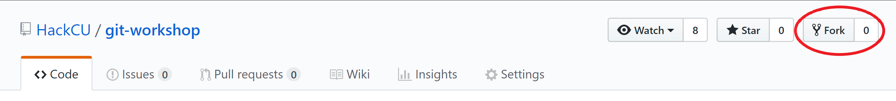
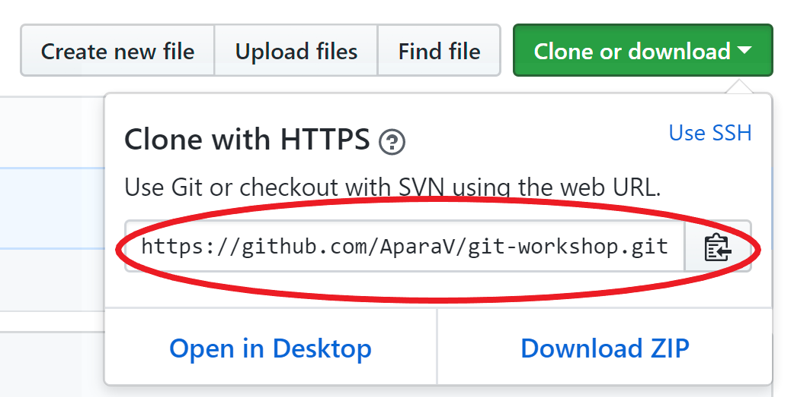
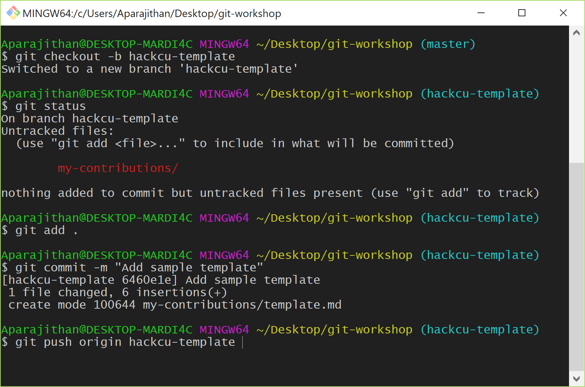
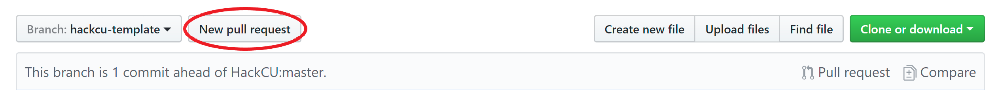
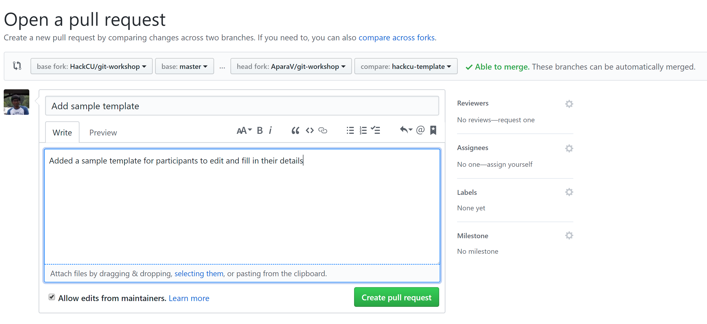

<br>
<p align="center">
  
</p>
<br>

# Git Workshop

You can find the slides from the Git workshop here. And this is also where you will be submitting your Pull Request.

## Ready to submit your PR?
As a part of the workshop, we asked you to make your first open source contribution by submitting a Pull Request here.
If you are unsure what a PR is, or you haven't attended the workshop, we recommend that you go back and review the slides.

Before submitting your PR, take a moment to consider what you have learnt and accomplished so far.
You know how Git works and you have Git in your arsenal for using it with your projects. It's a really powerful tool.
You also know how to collaborate with your team using Git.

That's a lot of stuff there! So congratulations on coming so far, and good luck with your PR!

<hr>

### Forking the repository
1. The first thing you want to do is to fork this repository into your account. Click the `Fork` button at the top right corner (below your profile picture) to create your own version of this repository.

<br>
<p align="center">
  
</p>
<br>

<hr>

### Cloning your fork
2. Now, go to your fork and click the green button that says `Clone or download`. Copy the link that is displayed and go to your terminal and run the following command:
```
$ git clone <url>
```
<br>
<p align="center">
  
</p>
<br>

<hr>

### Creating a branch and making changes
5. Once you `cd` into the repository on your computer, create a new branch with a descriptive name.
6. Then add a file into the `my-contributions` directory with your GitHub username.
7. Commit your changes.
8. Push your changes to your fork with the following command:
```
$ git push origin <your-branch-name>
```
This will create a new branch on your fork with the commits you made.

<br>
<p align="center">
  
</p>
<br>

<hr>

### Creating a PR
9. Now go back to your fork. You may have to refresh to fetch updates. Change the branch to the branch you just made.
10. Now click `New Pull Request` and change the base fork to `HackCU/git-workshop` and base to `master`. Ensure that the head fork is `<your-username>/git-workshop` and compare is `<your-branch-name>`

<br>
<p align="center">
  
</p>
<br>

11. Add a succinct, yet descriptive title. Describe in detail what your PR accomplishes. And hit `Create Pull Request`!

<br>
<p align="center">
  
</p>
<br>

<hr>

You're all set! Congratulations on creating your first Pull Request!&nbsp; :tada: <br>
Now, your journey will never end. Keep hacking!
